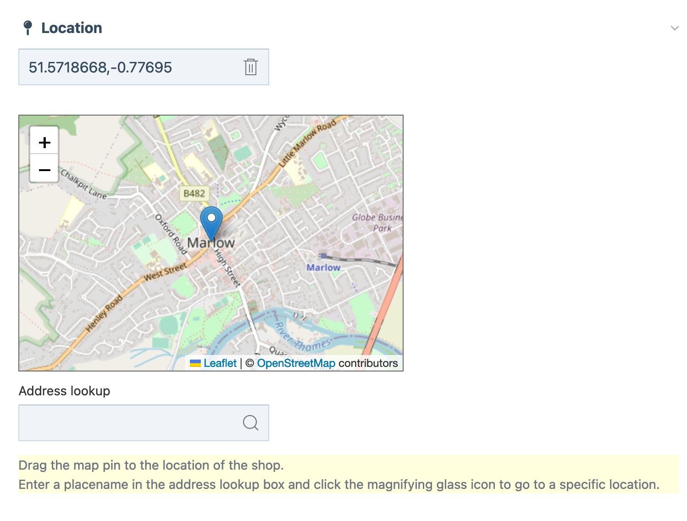

# MillcoLocation
Yet another location module for ProcessWire.

Users can drag a marker on map to get a lat lng value which is stored in a single field. 

There is also an address lookup field that uses OpenStreetMap Nominatum to try and convert an address to a lat lng value (nb currently I'm passing an extra flag to Nominatum to limit to GB adresses - you should take that out if you're somewehere else).

The map uses [OpenStreetMap](https://www.openstreetmap.org/) for the tiles and [Leaflet](https://leafletjs.com/) for the map library.

There are of course similar (more or less official) modules for ProcessWire for getting a location but they weren't quite right for us.

Because other options exist, I probably won't submit this to the module repo on the main ProcessWire site unless people want me to. I'm happy to take a look at any other developments you might need though, so feel free to get in touch.

[millipedia](https://millipedia.com/)